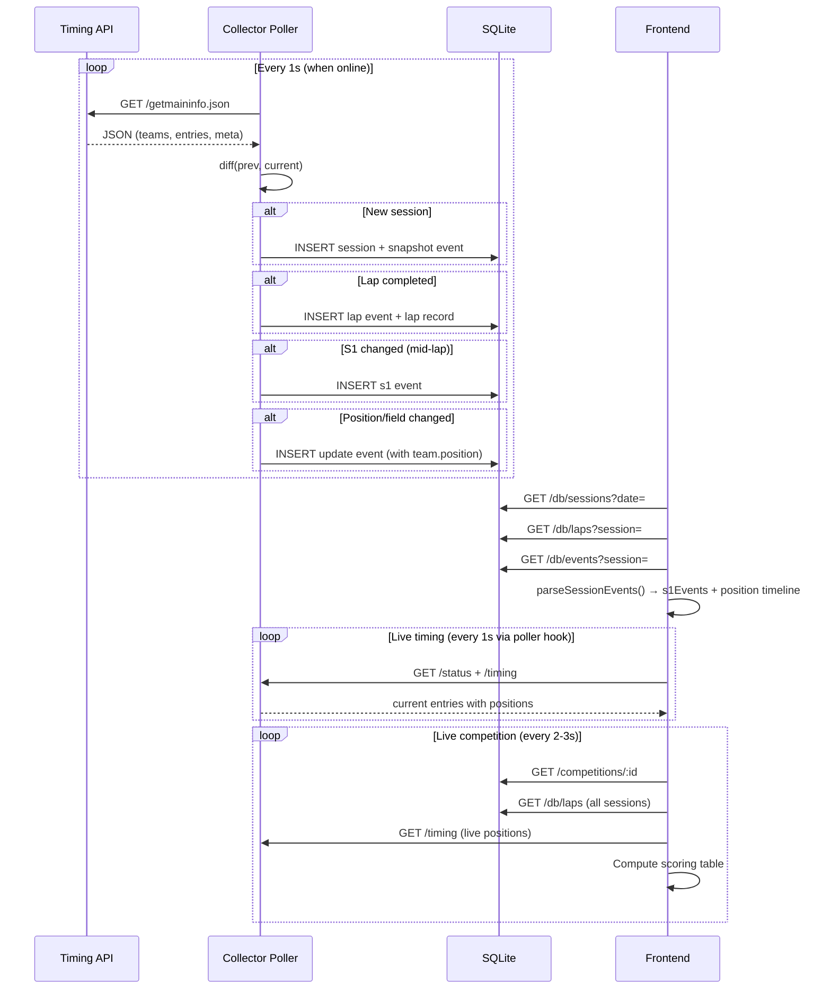
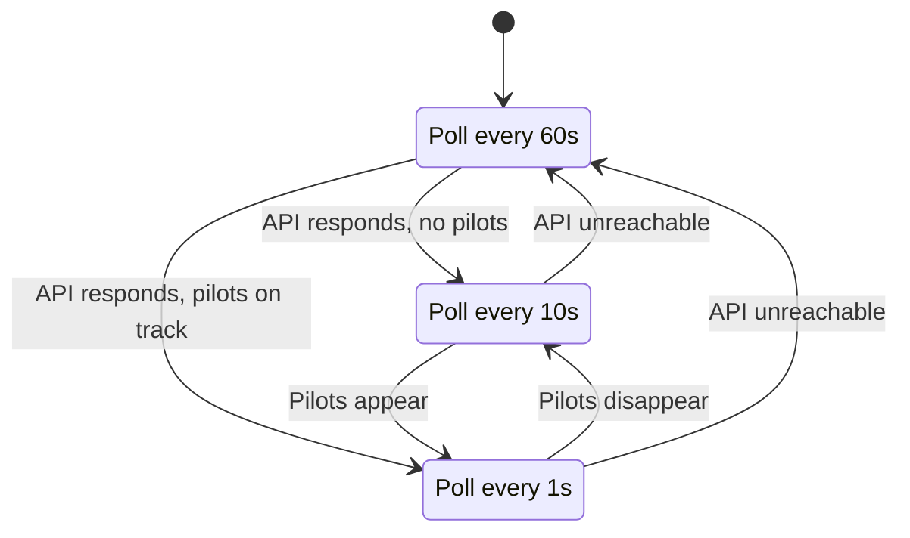
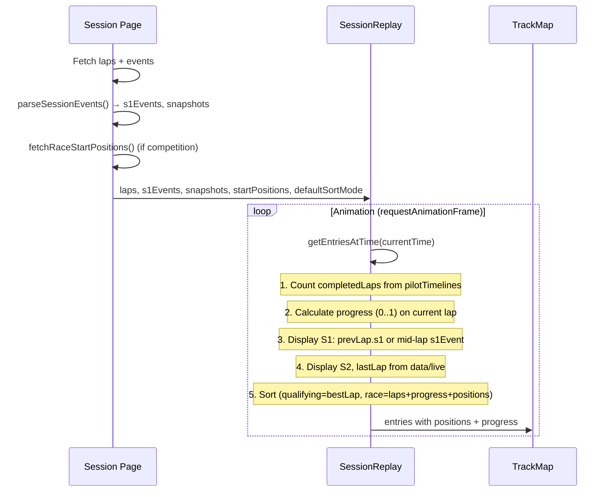
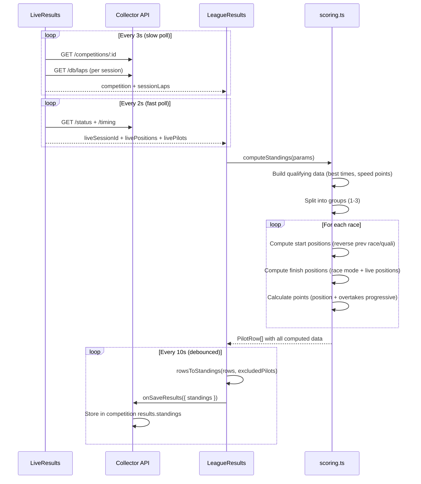
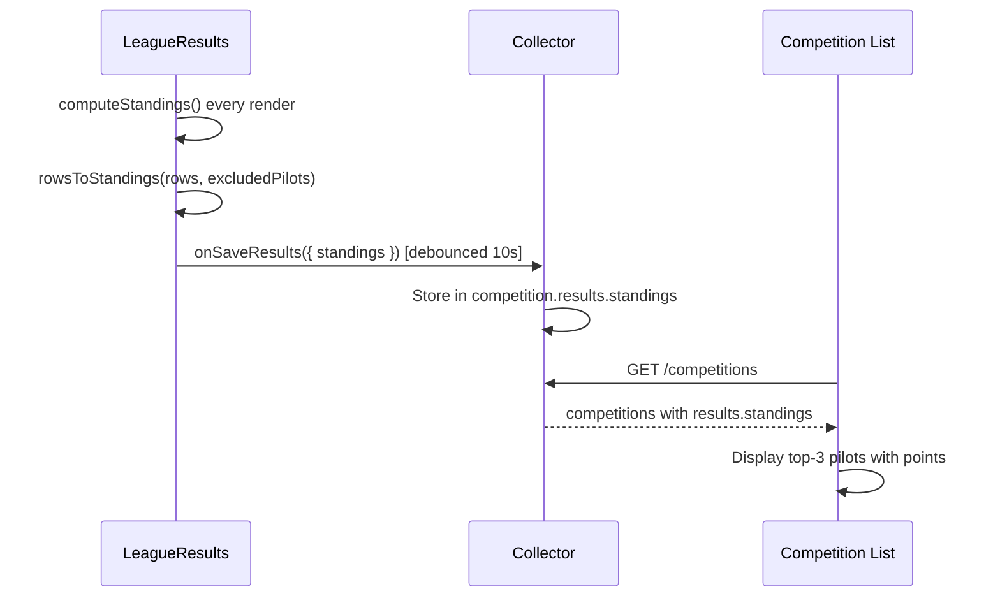

# Architecture

## System Overview

```
┌─────────────────────┐     ┌──────────────────┐     ┌───────────────────┐
│  Timing API          │     │  Collector        │     │  Frontend (React)  │
│  nfs.playwar.com     │────→│  Node.js + SQLite │←───→│  Vite + Tailwind   │
│  :3333               │poll │  :3001            │HTTP │  :5173 (dev)       │
└─────────────────────┘     └──────────────────┘     └───────────────────┘
                                    │
                            ┌───────┴────────┐
                            │  SQLite DB      │
                            │  karting.db     │
                            │                 │
                            │  sessions       │
                            │  events         │
                            │  laps           │
                            │  competitions   │
                            │  page_views     │
                            │  visitor_sessions│
                            │  db_stats       │
                            └─────────────────┘
```

## Data Flow



## Adaptive Polling



## Event System

The collector stores events in the `events` table. Each event has `session_id`, `event_type`, `ts` (unix ms), and `data` (JSON).

### Event Types

| Type | When | Data |
|------|------|------|
| `snapshot` | Session start only | `{ entries, teams, meta }` — full state |
| `lap` | Pilot crosses finish | `{ pilot, kart, lapNumber, lastLap, s1, s2, bestLap, position, team }` |
| `s1` | Pilot passes S1 sector (mid-lap) | `{ pilot, kart, s1, team }` |
| `update` | Non-volatile field change (position, pit status) | `{ pilot, kart, team }` |
| `pilot_join` | New pilot appears | `{ pilot, kart }` |
| `pilot_leave` | Pilot disappears | `{ pilot }` |
| `poll_ok` | No changes detected | `null` |

### Position Tracking

Positions are tracked through ALL event types that include `team.position`:
- `snapshot` → `entries[].position`
- `lap` → `data.position` + `data.team.position`
- `s1` → `data.team.position`
- `update` → `data.team.position` (fires when position changes)

Frontend's `parseSessionEvents()` builds an incremental position timeline from all events, giving per-second accuracy for replay.

## Session Replay Architecture



### Sort Modes

**Qualifying** (default): sorted by best lap time
**Race**: sorted by:
1. Lap count (desc)
2. Track progress (desc, if diff > 0.01)
3. Last recorded position from timing
4. Snapshot/event position (from position timeline)
5. Start positions (fallback)

## Competition Scoring Flow



## Scoring Module (`src/utils/scoring.ts`)

Shared pure-function module extracted from LeagueResults for reuse across components.

### Exported Functions
| Function | Purpose |
|----------|---------|
| `parseLapSec(lapTime)` | Parse lap time string to seconds |
| `getOvertakeRate(position, format)` | Get overtake multiplier for a position |
| `calcOvertakePoints(startPos, finishPos, format)` | Calculate progressive overtake points |
| `getPositionPoints(position, totalPilots, scoring)` | Look up position points from scoring table |
| `computeStandings(params)` | Main function: full scoring computation |
| `rowsToStandings(rows, excludedPilots)` | Convert PilotRow[] to CompetitionStandings for storage |

### Exported Types
`SessionLap`, `CompSession`, `ScoringData`, `PilotQualiData`, `PilotRaceData`, `PilotRow`, `ManualEdits`, `StandingsPilot`, `CompetitionStandings`, `ComputeStandingsParams`

## Standings Storage



### Standings Format
```json
{
  "updatedAt": 1712000000000,
  "pilots": [
    {
      "pilot": "Апанасенко Олексій",
      "totalPoints": 42.5,
      "qualiTime": "40.823",
      "qualiKart": 7,
      "qualiSpeedPoints": 2.5,
      "group": 1,
      "races": [
        { "startPos": 12, "finishPos": 1, "positionPoints": 12, "overtakePoints": 8.5, "speedPoints": 2.5, "penalties": 0 }
      ]
    }
  ]
}
```

## Key Design Decisions

### Session Merging
The timing API sometimes briefly drops (1-30s), creating multiple DB sessions for one real race. The collector merges sessions with the same `race_number` within 5 minutes via `/db/sessions?date=`.

### Pilot Name Merging
The timing system sometimes shows "Карт X" for initial laps. `mergePilotNames()` replaces with real names per-session. Manual rename via `/db/rename-pilot` for competition accuracy.

### Start Positions
- **Competition race**: computed from qualifying/previous race (via `fetchRaceStartPositions()`)
- **Regular session (race mode)**: from first snapshot event
- Start positions shown even before race starts (pre-filled from previous phase)

### Live Competition Updates
- `● LIVE` toggle button: pause/resume live polling
- Active session pilots highlighted (green tint)
- EditableCell keeps focus during re-renders (skips value sync while focused)
- Overtake points use progressive calculation (each position has own rate)
- Standings auto-pushed to collector every 10s (debounced) via `onSaveResults({ standings })`

### View Modes (LeagueResults)
- Все/Бали/Час/Поз/Ост — unified column visibility system via `PRESET_COLS`
- "Ост" (custom): user clicks column headers to toggle visibility
- Clicking group headers (Квала, Гонка N) toggles all sub-columns
- Clicking "Бали" sub-header toggles all 4 point columns
- Custom column set persisted per user+competition in localStorage
- Tap-to-select pilot rows (stays highlighted until tapped again)

### Competition Page (Unified)
- Single `/results` route shows ALL competitions
- Date navigator with this week default, previous week collapsible
- Type filter buttons (Все | Гонзалес | ЛЛ | ЛЧ | Спринти | Марафони)
- Competition date derived from first session timestamp
- Top-3 pilots with points shown (from stored standings)
- "Змагання" moved from dropdown to direct Link in header nav

### Mobile Optimizations
- `html, body { overflow-x: hidden }` prevents horizontal page scroll
- Header nav: `overflow-x-auto scrollbar-none` for horizontal scrolling
- All dropdowns: `position: fixed` with parent-level ref (no flicker)
- `UserDropdown` as separate component
- Tailwind `hoverOnlyWhenSupported: true` — hover only on pointer devices
- `-webkit-tap-highlight-color: transparent` on body
- `active:bg-dark-700/30` for touch feedback on table rows
- Today's date highlighted green (`bg-green-600/20`) on date navigators

### Settings Persistence
- Filter settings (competitions + karts dates) expire at end of day
- `loadWithExpiry(storage, key)` / `saveWithExpiry(storage, key, value)` utility functions
- Next day opens with default selections (current week for competitions, today for karts)
- Competition type filters, date selection, sort direction all persisted with expiry

### View Preferences
User view preferences (show/hide track, laps-by-pilots, league tables) persisted in localStorage by user email.
