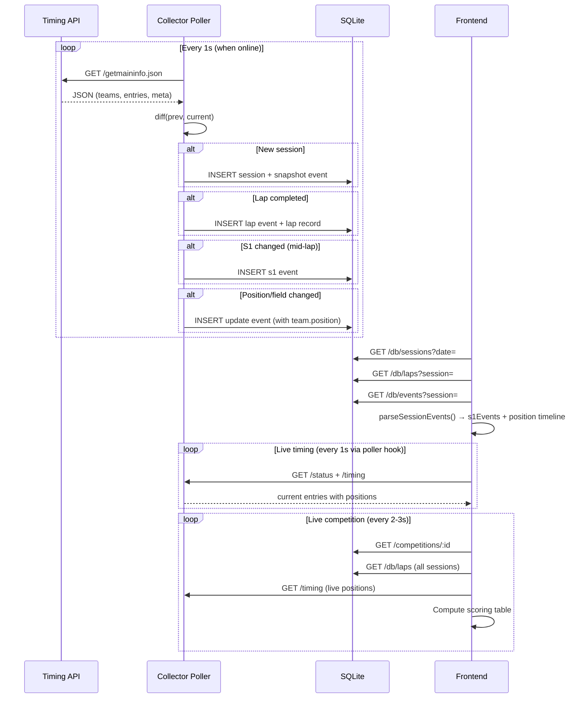
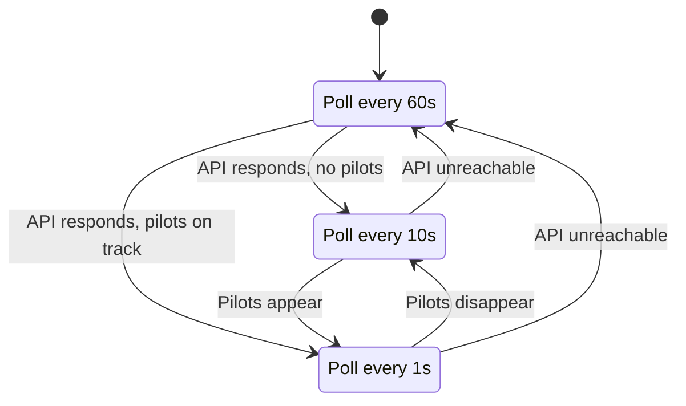
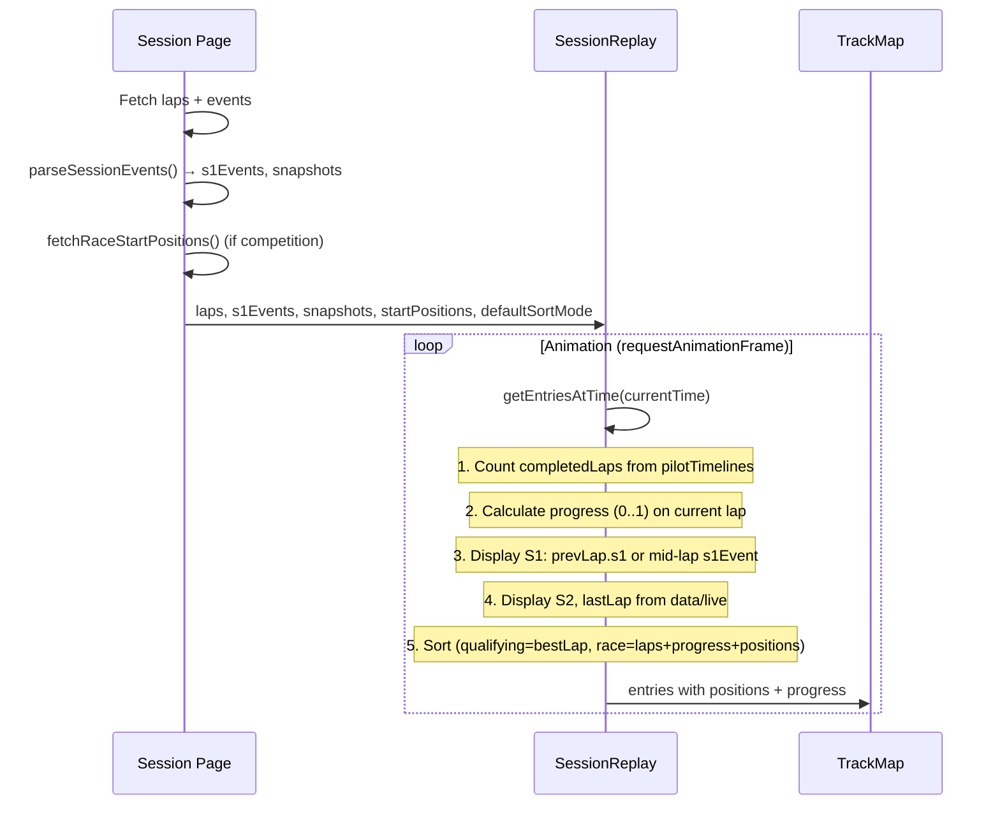
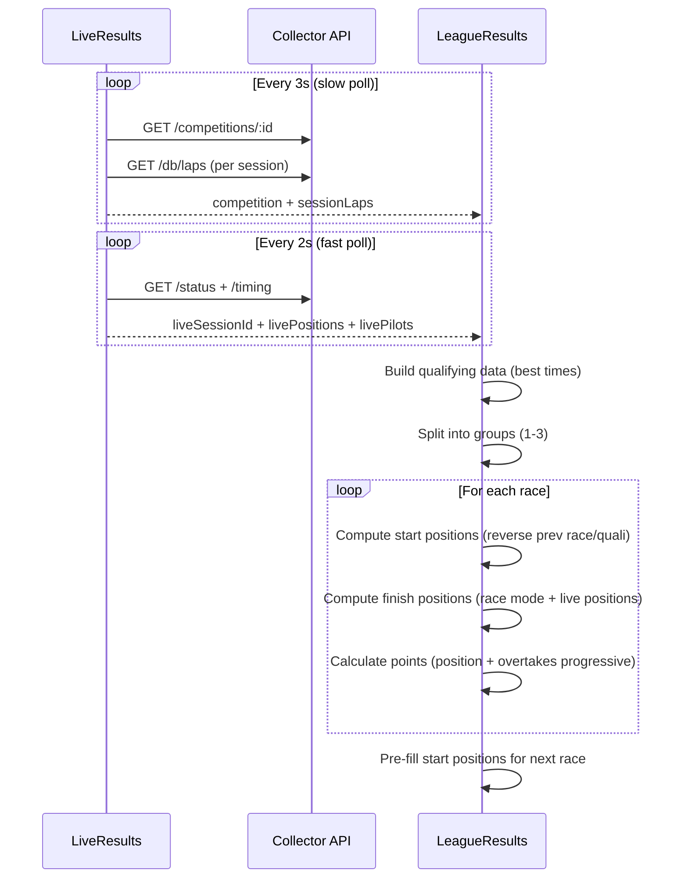

# Architecture

## System Overview

```
┌─────────────────────┐     ┌──────────────────┐     ┌───────────────────┐
│  Timing API          │     │  Collector        │     │  Frontend (React)  │
│  nfs.playwar.com     │────→│  Node.js + SQLite │←───→│  Vite + Tailwind   │
│  :3333               │poll │  :3001            │HTTP │  :5173 (dev)       │
└─────────────────────┘     └──────────────────┘     └───────────────────┘
                                    │
                            ┌───────┴────────┐
                            │  SQLite DB      │
                            │  karting.db     │
                            │                 │
                            │  sessions       │
                            │  events         │
                            │  laps           │
                            │  competitions   │
                            │  page_views     │
                            │  visitor_sessions│
                            │  db_stats       │
                            └─────────────────┘
```

## Data Flow



## Adaptive Polling



## Event System

The collector stores events in the `events` table. Each event has `session_id`, `event_type`, `ts` (unix ms), and `data` (JSON).

### Event Types

| Type | When | Data |
|------|------|------|
| `snapshot` | Session start only | `{ entries, teams, meta }` — full state |
| `lap` | Pilot crosses finish | `{ pilot, kart, lapNumber, lastLap, s1, s2, bestLap, position, team }` |
| `s1` | Pilot passes S1 sector (mid-lap) | `{ pilot, kart, s1, team }` |
| `update` | Non-volatile field change (position, pit status) | `{ pilot, kart, team }` |
| `pilot_join` | New pilot appears | `{ pilot, kart }` |
| `pilot_leave` | Pilot disappears | `{ pilot }` |
| `poll_ok` | No changes detected | `null` |

### Position Tracking

Positions are tracked through ALL event types that include `team.position`:
- `snapshot` → `entries[].position`
- `lap` → `data.position` + `data.team.position`
- `s1` → `data.team.position`
- `update` → `data.team.position` (fires when position changes)

Frontend's `parseSessionEvents()` builds an incremental position timeline from all events, giving per-second accuracy for replay.

## Session Replay Architecture



### Sort Modes

**Qualifying** (default): sorted by best lap time
**Race**: sorted by:
1. Lap count (desc)
2. Track progress (desc, if diff > 0.01)
3. Last recorded position from timing
4. Snapshot/event position (from position timeline)
5. Start positions (fallback)

## Competition Scoring Flow



## Key Design Decisions

### Session Merging
The timing API sometimes briefly drops (1-30s), creating multiple DB sessions for one real race. The collector merges sessions with the same `race_number` within 5 minutes via `/db/sessions?date=`.

### Pilot Name Merging
The timing system sometimes shows "Карт X" for initial laps. `mergePilotNames()` replaces with real names per-session. Manual rename via `/db/rename-pilot` for competition accuracy.

### Start Positions
- **Competition race**: computed from qualifying/previous race (via `fetchRaceStartPositions()`)
- **Regular session (race mode)**: from first snapshot event
- Start positions shown even before race starts (pre-filled from previous phase)

### Live Competition Updates
- `● LIVE` toggle button: pause/resume live polling
- Active session pilots highlighted (green tint)
- EditableCell keeps focus during re-renders (skips value sync while focused)
- Overtake points use progressive calculation (each position has own rate)

### View Preferences
User view preferences (show/hide track, laps-by-pilots, league tables) persisted in localStorage by user email.
